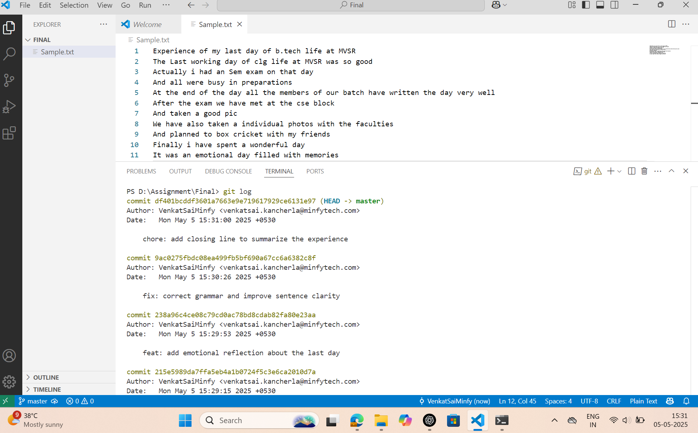

List of Commits:
commit 60e2ae62bd9bf4fe4d9d638c6939e3133e3cfd18 (HEAD -> master, origin/master)
Author: VenkatSaiMinfy <venkatsai.kancherla@minfytech.com>
Date:   Mon May 5 15:32:55 2025 +0530

    image

commit df401bcddf3601a7663e9e719617929ce6131e97
Author: VenkatSaiMinfy <venkatsai.kancherla@minfytech.com>
Date:   Mon May 5 15:31:00 2025 +0530

    chore: add closing line to summarize the experience

commit 9ac0275fbdc08ea499fb5bf690a67cc6a6382c8f
Author: VenkatSaiMinfy <venkatsai.kancherla@minfytech.com>
Date:   Mon May 5 15:30:26 2025 +0530

    fix: correct grammar and improve sentence clarity

commit 238a96c4ce08c79cd0ac78bd8cdab82fa80e23aa
Author: VenkatSaiMinfy <venkatsai.kancherla@minfytech.com>
Date:   Mon May 5 15:29:53 2025 +0530

    feat: add emotional reflection about the last day

commit 215e5989da7ffa5eb4a1b0724f5c3e6ca2010d7a
Author: VenkatSaiMinfy <venkatsai.kancherla@minfytech.com>
Date:   Mon May 5 15:29:15 2025 +0530

    feat:add last year experience at MVSR

Explanation:
Commit: 215e5989da7ffa5eb4a1b0724f5c3e6ca2010d7a
Message: add last year experience at MVSR
Explanation: Added details about the experience from last year at MVSR, starting the content in Sample.txt.

Commit: 238a96c4ce08c79cd0ac78bd8cdab82fa80e23aa
Message: add emotional reflection about the last day
Explanation: Included an emotional reflection about the last day to make the experience more personal.

Commit: 9ac0275fbdc08ea499fb5bf690a67cc6a6382c8f
Message: correct grammar and improve sentence clarity
Explanation: Fixed grammatical mistakes and improved sentence clarity in the content.

Commit: df401bcddf3601a7663e9e719617929ce6131e97
Message: add closing line to summarize the experience
Explanation: Added a final sentence to summarize and conclude the overall experience.

Commit: 60e2ae62bd9bf4fe4d9d638c6939e3133e3cfd18
Message: image
Explanation: Added an image to the project, possibly a screenshot or illustration for documentation.

Screenshot of GitLog:

After editig the README File:
Using the update-readme Branch
After editing the README:
Using the master branch
